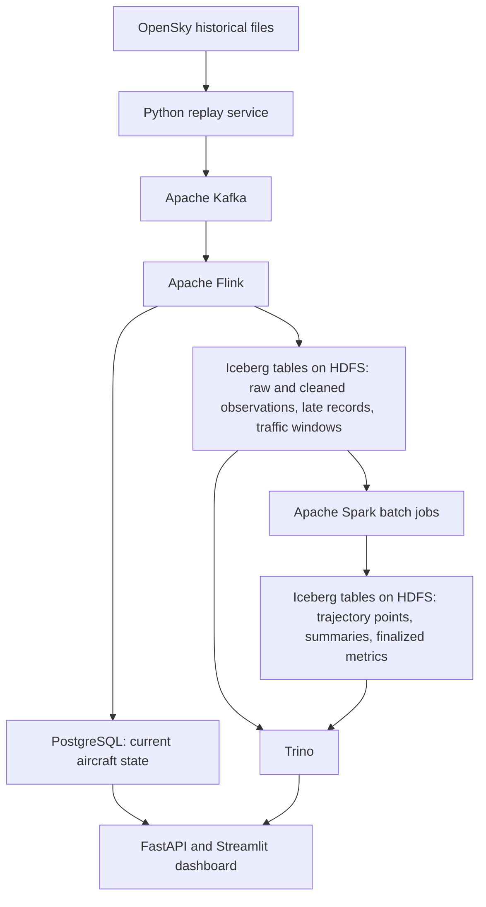

# Scalable Air Traffic Big Data Platform

A Big Data Storage and Processing course project that transforms aircraft telemetry into current aircraft states, historical trajectory segments, and regional traffic statistics.

**Status: Data acquisition prototype.** The repository now includes tools to download an OpenSky sample and inspect its data quality. The distributed processing services, deployment configurations, dashboard, and benchmarks are planned.

## Start here: get the data

The first working flow is:

```text
OpenSky historical archive → original file on disk → quality report
```

Use Python 3.10 or newer. These tools use the standard library; no packages or containers are needed. Run from the repository root:

```bash
# 1. Download one historical hour (about 101 MiB).
python3 scripts/download_sample.py

# 2. Inspect the first 100,000 observations.
python3 scripts/profile_sample.py

# 3. Run the offline tests using small synthetic observations.
python3 -m unittest discover -s tests -v
```

The download is stored in `data/raw/`. A manifest in `data/manifests/` records where it came from, its size, and its SHA-256 checksum. The quality report in `data/reports/` summarizes missing fields, invalid values, duplicate observations, and stale positions. Re-running the downloader verifies and reuses the local file.

The sample is from **June 27, 2022, 04:00–05:00 UTC**. It is historical data for development and later replay. The default report covers a prefix of the file, not the entire hour.

See the [data guide](data/README.md) for the file layout, field meanings, report interpretation, and download troubleshooting. Downloaded observations and local reports are excluded from Git.

The next implementation step is to define a normalized observation format and build deterministic replay from this verified input. The architecture below describes the intended full platform.

## Project objective

Aircraft telemetry creates a large spatiotemporal dataset containing repeated observations, missing measurements, stale positions, and events that may arrive out of order. Storing these observations without a processing strategy makes historical analysis expensive and current-state queries inefficient.

This project will build and evaluate a platform that:

- Ingests historical aircraft observations through a controllable replay service.
- Processes incoming observations with Apache Flink.
- Stores analytical tables as Parquet files managed by Apache Iceberg on HDFS.
- Uses Apache Spark for historical processing, trajectory reconstruction, and storage maintenance.
- Serves current aircraft states through PostgreSQL and historical analytics through Trino.
- Measures correctness, storage efficiency, processing performance, and recovery behavior.

## Data products

| Product | Intended capability | Processing and serving |
| --- | --- | --- |
| Current aircraft state | Find recently observed aircraft in a region and display their latest usable positions. | Flink updates PostgreSQL; a small API serves the dashboard. |
| Historical trajectory segments | Retrieve ordered aircraft positions, duration, observed distance, and coverage gaps. | Spark produces point and summary tables in Iceberg; Trino queries them. |
| Regional traffic statistics | Compare observed aircraft counts, altitude, speed, and vertical movement across areas and time windows. | Flink produces streaming metrics; Spark produces reconciled historical results. |

The current-state demonstration targets **p95 ingestion-to-display latency of at most five seconds** at a declared replay rate. This is a performance target to validate, not an implemented guarantee. During historical replay, “current” refers to the visible simulation clock.

## Proposed architecture



Flink and Spark have distinct responsibilities: Flink handles incoming events and stateful streaming; Spark handles historical reconciliation, trajectory reconstruction, and batch maintenance. The current-state branch updates independently of analytical window completion.

All analytical engines will share an Iceberg JDBC catalog backed by PostgreSQL. Catalog metadata and current aircraft state will use separate databases. HDFS provides distributed file storage, Parquet provides columnar encoding, and Iceberg manages the analytical tables.

## Technology stack

| Technology | Planned role |
| --- | --- |
| Apache Kafka | Partitioned ingestion and durable buffering. |
| Apache Flink / Java | Validation, normalization, duplicate handling, event-time windows, and current-state updates. |
| Apache Spark / PySpark / SQL | Historical reconciliation, trajectory reconstruction, batch analytics, and file compaction. |
| HDFS | Distributed storage and configurable block replication. |
| Apache Parquet + Apache Iceberg | Compressed analytical files, table metadata, snapshots, and partition management. |
| Trino | Historical SQL queries and query-performance evaluation. |
| PostgreSQL | Current aircraft state and the Iceberg JDBC catalog in separate databases. |
| Python / FastAPI / Streamlit | Replay tools, read-only APIs, and a focused demonstration interface. |
| Docker Compose | A small local development environment. |
| Kubernetes / K3s + Tailscale | Final deployment across remote Linux VMs hosted on the team's MacBooks. |
| Prometheus + Grafana | Processing, storage, query, and network observability. |

## Dataset and scale

The initial source is the [OpenSky Network's published scientific state-vector samples](https://opensky-network.org/data/scientific). The [source configuration](data/sources/opensky_sample.json) pins one hourly archive for the acquisition prototype. Larger dataset coverage and capacity still need measurement.

- **Core target:** process at least 10 million real observations.
- **Extension target:** process 50 million real observations, subject to measured storage and network capacity.
- **Replay:** support controlled rates, accelerated playback, and reproducible fault injection.
- **Provenance:** record source files, checksums, row counts, time ranges, and coverage in a dataset manifest.

Repeated replay events will be reported separately from unique source observations. Gaps between sampled days will remain visible, and the platform will describe observed trajectory segments and observed traffic rather than infer complete flights or complete airspace coverage.

Live OpenSky ingestion is an extension after the historical pipeline is working.

## Course focus and evaluation

The project will investigate:

- **Distributed storage:** HDFS replication factors, physical storage consumption, and DataNode failure recovery.
- **Storage layout:** partition pruning, aircraft bucketing, and the effect of small-file compaction.
- **Stream processing:** event-time correctness, duplicate handling, state recovery, and backpressure.
- **Batch processing:** Spark partitioning, shuffles, execution plans, and worker scaling.
- **Analytical queries:** latency, scanned bytes, file counts, and cache effects.

Experiments will use fixed inputs and configurations, repeated measurements, and recorded network conditions. Performance improvements are hypotheses to test; results will explain cases where additional workers provide limited benefit.

## Deployment constraints

The current resource estimate is a five-person team with four M2/M3 MacBooks, each with approximately 16 GB RAM and 50–100 GB of available disk. The machines are in different locations.

Development will begin with Docker Compose. The final deployment will use one ARM64 Linux VM per MacBook, joined into a K3s cluster through Tailscale. Separate experiment profiles will allocate memory to Flink, Spark, or Trino according to the workload being measured.

The first milestone must verify remote connectivity and sustained throughput. The baseline will demonstrate worker and HDFS DataNode recovery, while documenting the availability limits of its single NameNode, Kafka broker, and control-plane machine.

## Documentation

- [Data acquisition guide](data/README.md): commands, source fields, quality checks, and local artifacts.
- The local working roadmap is kept in `plan.md`, which is excluded from Git.
- Deployment instructions will be added alongside working service configurations.

## Technical references

- [OpenSky scientific datasets](https://opensky-network.org/data/scientific)
- [HDFS user guide](https://hadoop.apache.org/docs/current/hadoop-project-dist/hadoop-hdfs/HdfsUserGuide.html)
- [Apache Iceberg documentation](https://iceberg.apache.org/docs/latest/)
- [Trino HDFS support](https://trino.io/docs/current/object-storage/file-system-hdfs.html)
- [Trino Iceberg JDBC catalog](https://trino.io/docs/current/object-storage/metastores.html#jdbc-catalog)
